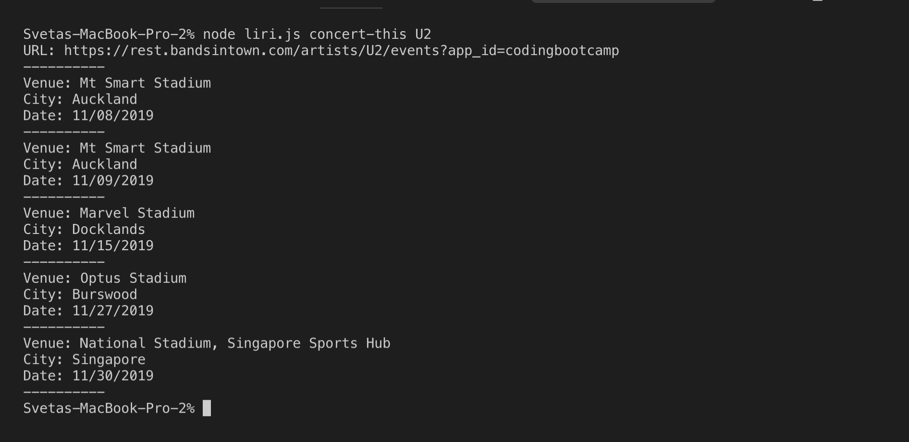
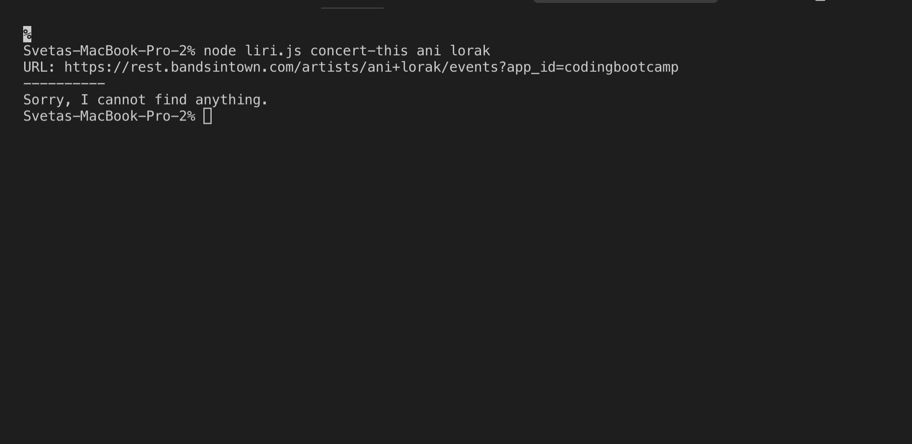
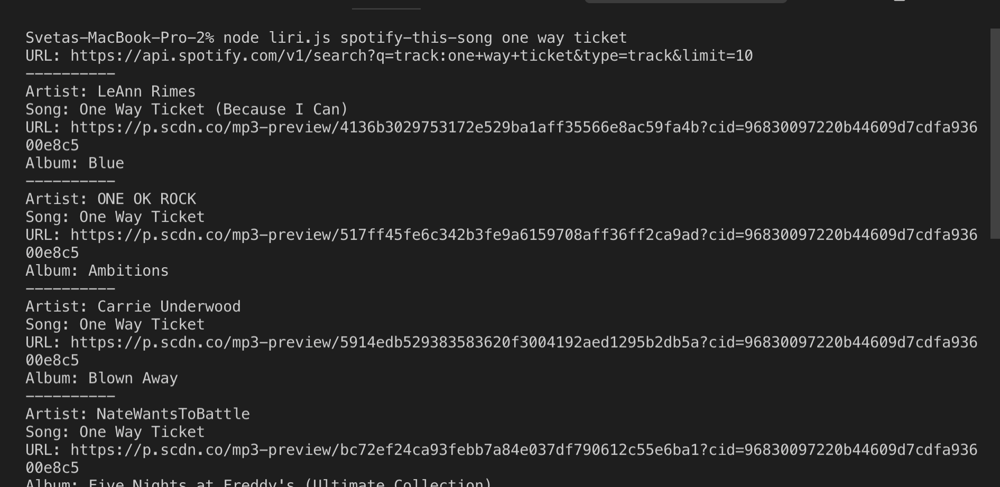
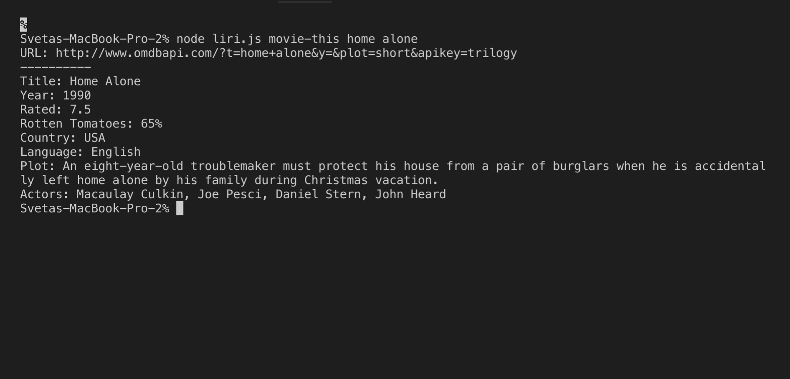
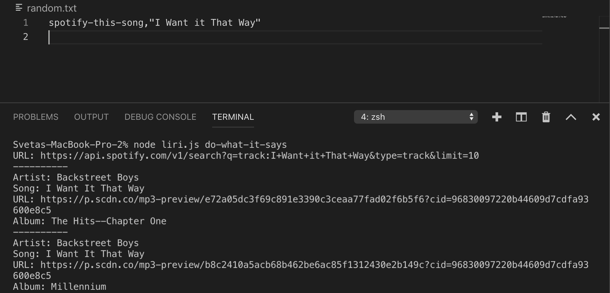
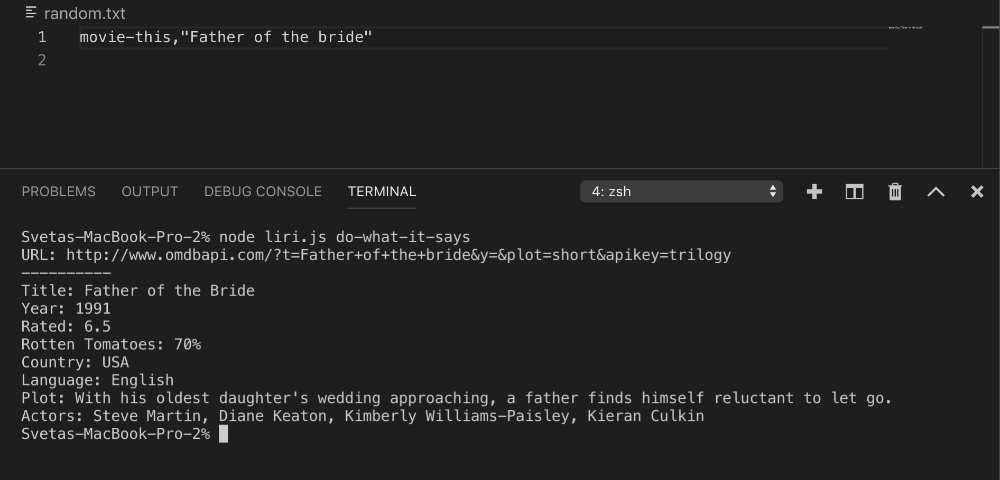
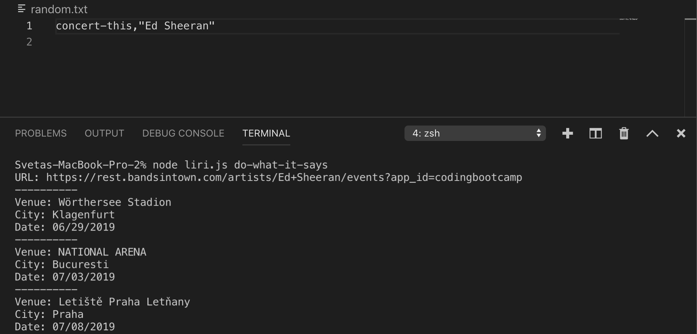

## LIRI-node-app (Language Interpretation and Recognition Interface)
LIRI will search Spotify for songs, Bands in Town for concerts, and OMDB for movies.
LIRI is a command line node app that takes in parameters and gives you back data based off the following parameters: 

-	concert-this
-	spotify-this-song
-	movie-this
-	do-what-it-says

### Getting Started: 
Install all needed packages: axios, dotenv, moments, node-spotify-api with npm or just run npm install (it will look up all packages in package.json).
Create .env file with your spotify secrets.


#### concert-this: 



In terminal, type this command:
```
node liri.js concert-this U2
```
This will search the Bands in Town Artist Events API for U2 band and render the following information about each event:

-	Venue name
-	Location
-	Date of the Event

If the band name is not recognized by the API (no results returned), LIRI will output "Sorry, I cannot find anything"




#### spotify-this-song: 



In terminal, type this command:
```
node liri.js spotify-this-song I Want it that way
```
This will show the information about the song:

-	Artist
-	Name of the song
-	Spotify preview link
-	The album name

#### movie-this: 



In terminal, type this command:
```
node liri.js movie-this Home Alone
```
This will output the information:
-	Title
-	Year the movie came out.
-	IMDB Rating.
-	Rotten Tomatoes Rating.
-	Country where the movie was produced.
-	Language.
-	Plot of the movie.
-	Actors in the movie.

#### do-what-it-says (for spotify-this-song): 



In random.txt file, you will have the following text:
```
spotify-this-song,"I Want it That Way"
```
Then, in terminal, type this command:
```
node liri.js do-what-it-says
```
LIRI will use the text from “random.txt” and call on of LIRI’s commands. 
It will run spotify-this-song for “I want it That Way”.

#### do-what-it-says (for movie-this): 



In random.txt file, you will have the following text:
```
movie-this,"Father of the bride"
```
Then, in terminal, type this command:
```
node liri.js do-what-it-says
```
LIRI will use the text from “random.txt” and call on of LIRI’s commands. 
It will run movie-this for “Father of the bride”.

#### do-what-it-says (for concert-this): 



In random.txt file, you will have the following text:
```
concert-this,"Ed Sheeran"
```
Then, in terminal, type this command:
```
node liri.js do-what-it-says
```
LIRI will use the text from “random.txt” and call on of LIRI’s commands. 
It will run concert-this for “Ed Sheeran”.

### Technologies used:

* Spotify API
* OMDB API
* Bands In Town API
* Node.js
* Javascript
* NPM packages

#### [Link to portfolio](https://code-sy.github.io/Portfolio/portfolio.html)
